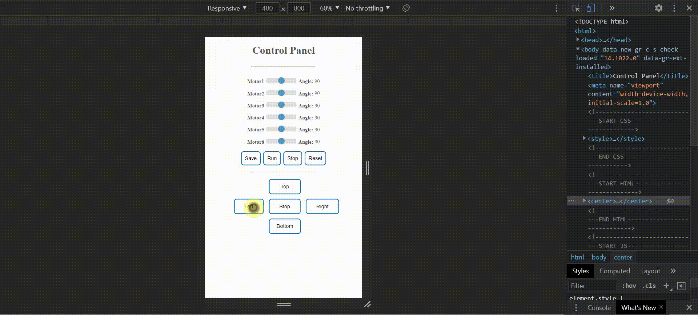

# Robot_Control_Panel

This project to move robot by using control panel interface.

## Requirements:
  - Programs
    - XAMPP
      - Apache
      - MySQL
  - Languages
    - Front End
      - HTML5
      - CSS
      - JS
    - Back End
      - PHP

## Configuration:
  - Stop all programs using `port 80` to run Apache: 
    - Admin cmd: `net stop http`

## Demo

